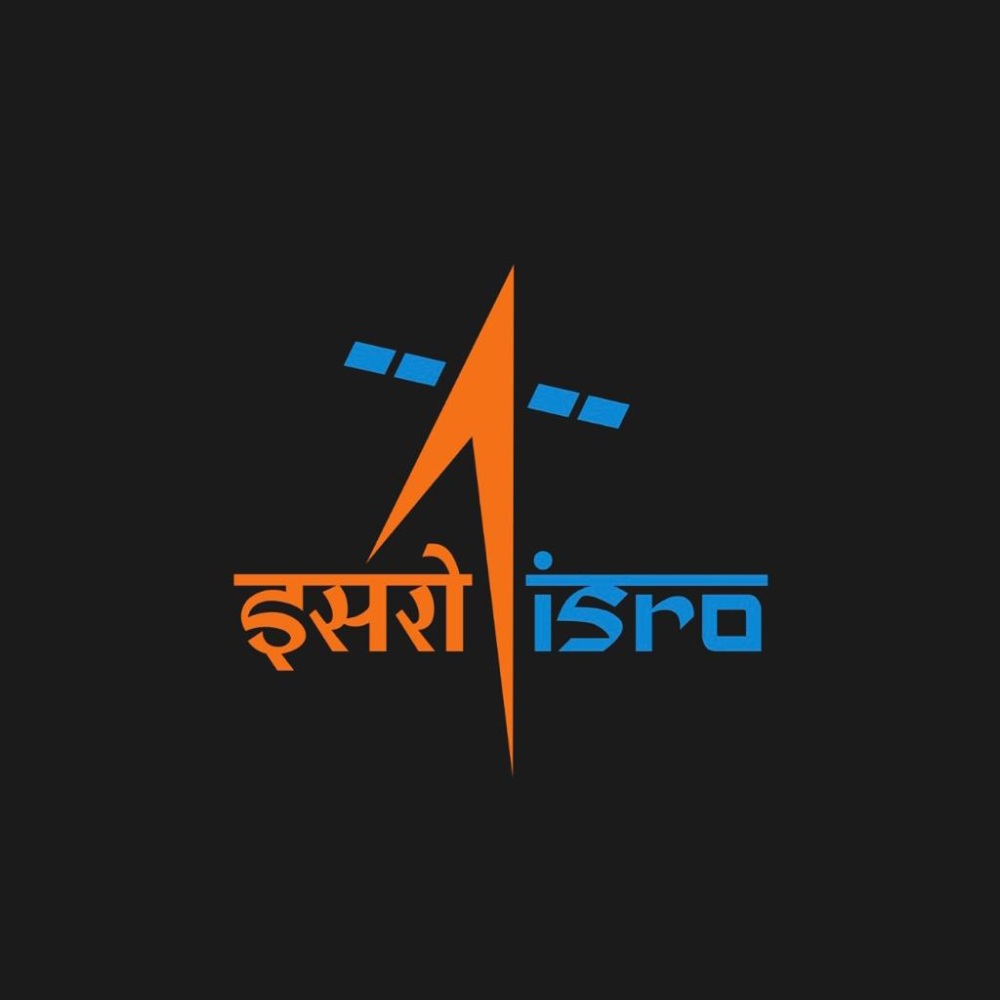
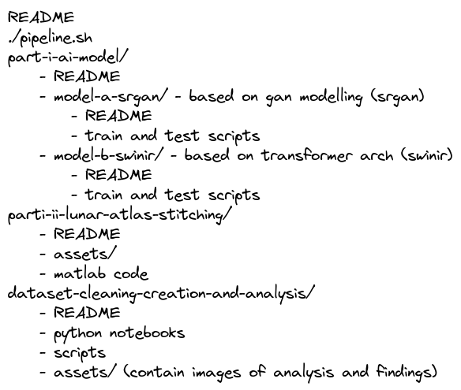

# Inter IIT Tech Meet 11.0: ISRO 
## The Chandrayaan Moon Mapping Challenge

### Table of Contents

- [Objective](#objective)
- [Submission Drive Links](#submission-drive-links)
- [Repository Directory Structure](#repository-directory-structure)
- [Acknowledgement](#acknowledgement)

## Objective

**Part 1**: Development of an AI/ML model to generate high (~30 cm) resolution lunar terrain image from medium/low (5 m / 10 m) resolution terrain image, and evaluate its accuracy; the model will be amenable to further training and improvement.

**Part 2**: To generate a global lunar atlas (digital) with the help of the AI/ML model, based on the medium / low resolution data available. The AI/ML model to be developed by using the publically available overlapping data of OHRC (~30 cm resolution) and TMC-2 (5 m /10 m resolution) payload data on board Chandrayaan-2 Orbiter.

## Submission Drive Links


## Repository Directory Structure

```
README
./pipeline.sh
part-i-ai-model/
    - README 
    - model-a-srgan/ - based on gan modelling (srgan)
        - README
        - train and test scripts
    - model-b-swinir/ - based on transformer arch (swinir)
        - README
        - train and test scripts
parti-ii-lunar-atlas-stitching/
    - README
    - assets/
    - matlab code
dataset-cleaning-and-analysis/
    - README
    - python notebooks
    - scripts
    - assets/ (contain images of analysis and findings)
```



## Acknowledgement

- SwinIR: Image Restoration Using Swin Transformer

```
@article{liang2021swinir,
  title={SwinIR: Image Restoration Using Swin Transformer},
  author={Liang, Jingyun and Cao, Jiezhang and Sun, Guolei and Zhang, Kai and Van Gool, Luc and Timofte, Radu},
  journal={arXiv preprint arXiv:2108.10257},
  year={2021}
}
```

- Photo-Realistic Single Image Super-Resolution Using a Generative Adversarial Network

```
@InProceedings{srgan,
    author = {Christian Ledig, Lucas Theis, Ferenc Huszar, Jose Caballero, Andrew Cunningham, Alejandro Acosta, Andrew Aitken, Alykhan Tejani, Johannes Totz, Zehan Wang, Wenzhe Shi},
    title = {Photo-Realistic Single Image Super-Resolution Using a Generative Adversarial Network},
    booktitle = {arXiv},
    year = {2016}
}
```

- https://up42.com/blog/tech/super-resolution-of-multispectral-satellite-images-using-convolutional
- https://github.com/up42/image-similarity-measures