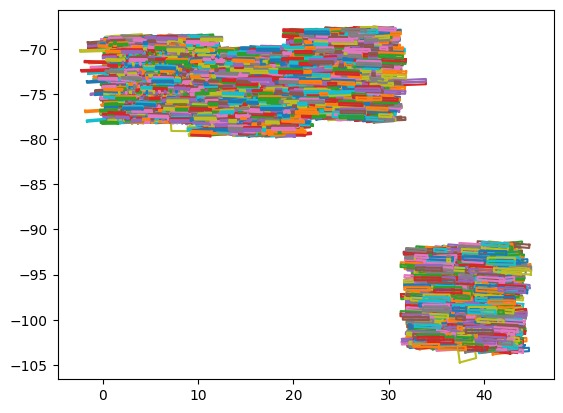

# Dataset Cleaning, Creation and Analysis

### Table of Contents

- [Overview](#overview)
- [Area Coverage](#area-coverage)

## Overview

Data for training the model was generated by
- finding NAC images that were completely contained within a given TMC (orthorectified) image,
- calibrating the NAC image using the software pipeline recommended by the [LRO research centre],
- cropping the TMC image to the coordinates of the NAC image,
- matching the contrast and brightness of the cropped image to the corresponding area in the ‘browse’ image provided with it, as well and modifying the contrast and brightness of the NAC image to the same,
- rotating the cropped TMC image in photo manipulation software so that features (such as craters) were located in exactly the same place as corresponding features in a scaled-down version of the NAC image, and then cropping the TMC image to the same,
- and, finally, cutting up both the NAC image and final TMC image into 96x96 px and (resized from a size between 20-24px to) 24x24 px image pairs. Images that were filled with no-data pixels (i.e. fully black) were excluded.

One TMC-NAC pair yielded ~13,000 image pairs, so two such pairs were used for training. Image pairs were manually selected so that many different sizes of craters, as well as other features, were included.

OHRC-TMC pairs were not used because, initially, it was thought that a large amount of data would be necessary. However, out of ~90 OHRC images, only ~10 overlapped with TMC images. GIS software (specifically the application QGIS) was used to ascertain this.
TMC data was scraped from the provided website using Selenium (browser automation software) as trying to get the details of an arbitrary TMC record using a network request was very difficult if not outright impossible due to the website’s structure. Data was also extracted from the TMC shapefiles provided on the downloads page. This data was used for stitching the TMC images together. The shapefiles, viewed in QGIS, also showed where there was a density of TMC images, which was useful for testing stitching as well as finding TMC images close to the equator (where the images would ideally be the most rectangular).

The details of NAC images corresponding to a TMC image were also scraped. This was used to locate NAC images that were facing almost directly North by filtering out images where the longitudes of the left and right corners and the latitudes of the top and bottom corners weren’t the same.

NAC image EDRs (experimental data records) were then downloaded and calibrated according to the image processing guide provided by the [LRO research centre]. For this, a shell script was developed to automatically process several NAC images one after the other.

The TMC image was then cropped by taking the longitude and latitude extents (the widest reach of the NAC image) of the given NAC image, translating them into pixel coordinates using a simple Python script, and then manually cropping the TMC image using Fiji (an updated version of ImageJ). Fiji was also used to manually adjust the contrast and brightness of images as stated. A digital colour meter was used to ensure that the colours matched quantitatively. 

GIMP was used to precisely rotate the cropped TMC image. Slight scaling changes were also done to make the images match better. This was also done manually.

The TMC-NAC image pair was then cut into several small squares (as described above) using a Python script.

## Area Coverage

### TMC 

### OHRC

### NAC

