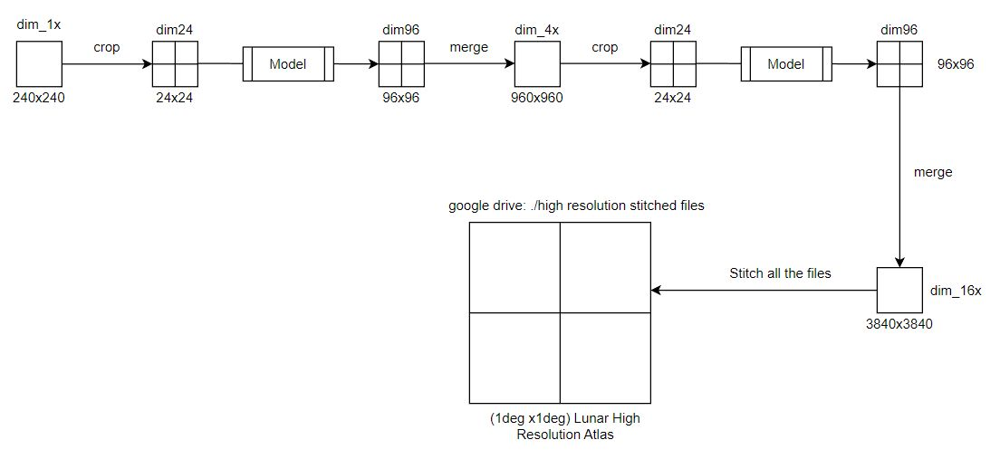

# Part 1: AI/ML model to generate high (~30 cm) resolution lunar terrain image

We have tried, implemented and customised two different ML architectures for this task of super-resolution using generative modelling as follows:

## SRGAN [Paper](https://arxiv.org/abs/1609.04802)

- Based on Generative Adversarial Networks
- The training and inference scripts, and the README guide are available in `model-a-srgan` folder.

The general pipeline we followed in SRGAN model can be summarised as 

## SwinIR [Paper](https://arxiv.org/abs/2108.10257)

- Based on Shifted-Window Transformers
- The training and inference scripts, and the README guide are available in `model-b-swinir` folder.
