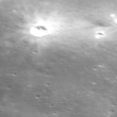

# SRGAN-PyTorch

## Overview

## Walkthrough Filesystem

- `model.py` : model architecture
- `train_srgan.py` : run this file to train from scratch or continue training of the SRGAN model
- `generate_srgan.py` : run this file to generate a 16 times superscaled image from TMC2 image
- `evaluation.py` : run this file to evaluate our 16 times upsameled data with test ohrc over SSIM evalaution metric
- `srgan_config.py` : configure training or generating parameters here
- `dataset.py` : creates batches of tensors from training or testing data using dataloader
- `image_quality_assessment.py` : code for evaluation metrics
- `requirements.txt` : environment requirements
- `cascade.py` : premature version of generate.py

- `train_data` : strore train data here
- `pretrained_weights` : strore pretrained weights here
- `results` : best and latest weights for both generator and discrimniator while training will be saved here
- `samples` : logs and per epoch weights can be seen here


## Pretrained Weights

- [Google Driver](https://drive.google.com/drive/folders/1n3-2heTW7SU7Sjh-86cEz6Hi0FJkA_jm?usp=share_link)
- Download the above folder, replace it with the pretrained_weights directory in the file system 
- Weights for continuing tha training ahead will be present in `./pretrained_weights/train`
- g_model weights : `g_last.pth.tar`
- d_model weights : `d_last.pth.tar`
- These can be used for the purpose of further training the model over custom dataset.
- Weights for generating Super Resolution images from TMC2 testing data will be present in `./pretrained_weights/train`
- g_model weights : `g_best.pth.tar`

## Datasets

- We used 2 types of datasets for fine tuning the model
- One, in which the model takes a high resolution image as input and crops in several images of 96x96, creates its 4 times downsampled counterpart and trains over that data. (data size = 750 images)
- Another, in which we manually feed both high resolution and corresponding low resolution image, the high resoltion image is a 96x96 NAC image while the low resoltion image is a 24x24 TMC2 image such that the corner coordinates of both the images are same. (data size = 13243 images)

- [Google Driver](https://drive.google.com/drive/folders/1HPzvEQHVjSSQeGu2WyX8IHNLsrY-HzBs?usp=share_link)
- Download the above folder, replace it with the train_data directory in the file system and unzip both `train.zip` and `test.zip` files in the `train_data` folder
- The first type of dataset we used for training will be present in `train_data/train/NAC_highres_dataset`
- The second type of dataset we used for training will be present in `train_data/train/TMC2NAC_dataset`
- The validation data to be used along with training will be present in `train_data/test`

- [Google Driver](https://drive.google.com/drive/folders/1Ac0Pirfl5W8RqUe_kEUx7c6mos3ueDcY?usp=share_link)
- From the above folder download `dim_1x.zip` place it in `./generate_data/TMC2`, unzip the zip file here


## How to Train, Genearte and Evaluate

All three training, testing and evaluation only need to modify the `./srgan_config.py` file.
For all the bash commands current working directory is expected to be `SRGAN-implementation`

### Generate SuperResolution images

Modify the `srgan_config.py` file.

- line 29: `mode` change to `generate`.
- line 31: `exp_name` change to a new experiment name each time training.
- line 102: `g_model_weights_path` change to `./pretrained_models/generate/g_best.pth.tar`.
- the input low resoltion files must be of dimension AxA where A is a multiple of 24
- store the input low resoltion files in the directory `./generate_data/TMC2/dim_1x`.
- the corresponding output images can be found in the directory `./generate_data/TMC2/dim_16x`.

```bash
python generate_srgan.py
```

### Train SRGAN model

Modify the `srgan_config.py` file.

- line 29: `mode` change to `train`.
- line 31: `exp_name` change to a new experiment name each time training.
- line 47: `pretrained_d_model_weights_path` change to `./pretrained_models/train/d_last.pth.tar`.
- line 48: `pretrained_g_model_weights_path` change to `./pretrained_models/train/g_last.pth.tar`.
- best and last trained weights of both generator and discrimnator would be saved in `./results/{exp_name}`.

```bash
python train_srgan.py
```

### Evaluation

Modify the `srgan_config.py` file.

- line 29: `mode` change to `evaluate`.
- [Google Driver](https://drive.google.com/drive/folders/1Ac0Pirfl5W8RqUe_kEUx7c6mos3ueDcY?usp=share_link)
- From the above folder download `dim_16x.zip` place it in `./generate_data/TMC2`, unzip the zip file here

```bash
python evaluation.py
```

- this unzipped folder can also be used to run evaluation over other metrics
- per image size in this folder is 3840x3840 8-bit images


### Installations

`pip install opencv-python`
`pip install numpy`
`pip install tqdm`
`pip install torch`
`pip install torchvision`
`pip install natsort`
`pip install typing`
`pip install scipy`

Input:

<span align="center"></span>

Output: 

<span align="center"></span>